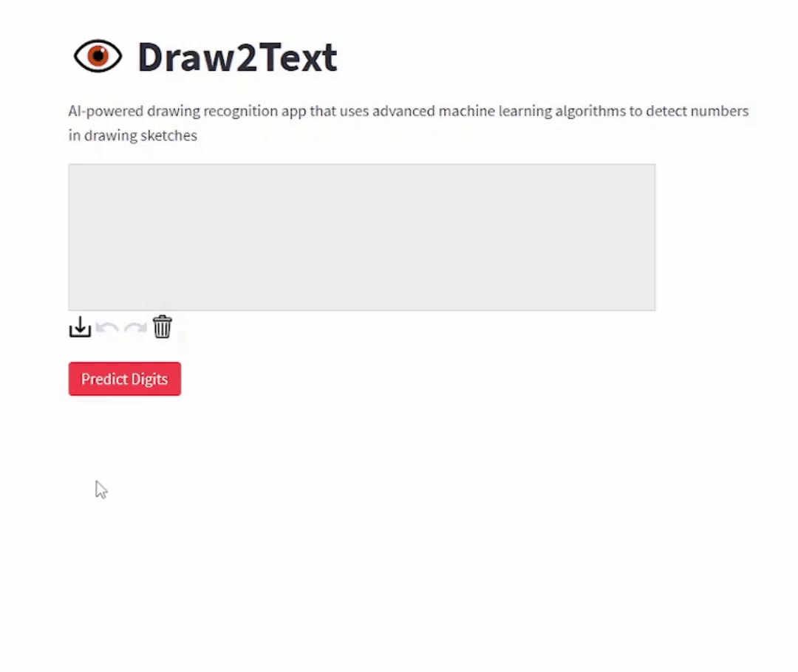
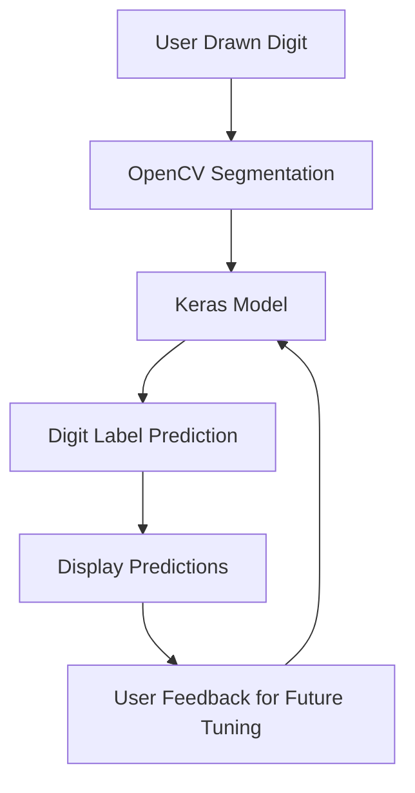

# Draw2Text

[](https://draw2text.streamlit.app/)

<p align="center">
    <a href="https://energygenforecaster.streamlit.app/"></a>
</p>

AI-powered drawing recognition app that uses advanced machine learning algorithms to detect numbers and letters in drawing sketches

## How it works



1. The user draws a digit in the canvas provided by the app
2. The app takes the image of the digit and uses OpenCV (an open source computer vision library) to segment it
3. The segmented digit image is then passed to a neural network created with Keras
4. The Keras model uses deep learning techniques to analyze the digit image and make a prediction of which digit it represents.
5. The app displays the predicted digit label to the user and asks for feedback. The feedback can be used to tune the model for better accuracy in future predictions.

## Getting Started

To run the app locally, please follow these steps:

1. Clone the repository

```
git clone https://github.com/olucaslopes/Draw2Text.git
```

2. Install the required packages

```
pip install -r requirements.txt
```

3. Run the app

```
streamlit run app.py
```

## Contact

You can find out more about me [on my Linkedin](https://www.linkedin.com/in/o-lucas-lopes)
