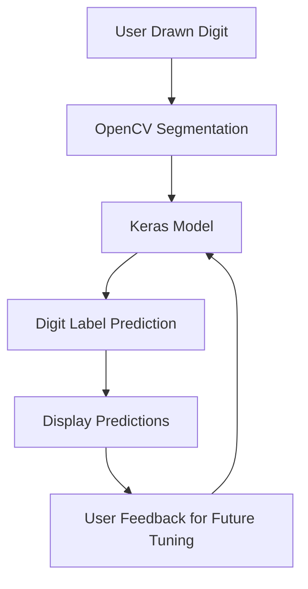

# 👁 Draw2Text: AI-powered digit recognition app

[](https://draw2text.streamlit.app/)

<p align="center">
    <a href="https://energygenforecaster.streamlit.app/"></a>
</p>

Draw2Text is an innovative web application that recognizes numbers and letters drawn by users in the canvas. It uses advanced machine learning algorithms, including computer vision and deep learning, to segment the drawn image, predict the digit/letter label, and display the result to the user. The app also enables users to provide feedback, which can be used to fine-tune the model for better accuracy in future predictions.

## How it works

1. The user draws a digit or letter on the provided canvas
2. The app uses OpenCV, an open-source computer vision library, to segment the canvas in digits images
3. The segmented image is then passed to a neural network created with Keras, which uses deep learning techniques to predict the digit label.
4. The predicted label is then displayed to the user.
5. The user can provide feedback to improve the model's accuracy in future predictions.



## Getting Started

To run the app locally, please follow these steps:

1. Clone the repository

```
git clone https://github.com/olucaslopes/Draw2Text.git
```

2. Install the required packages

```
pip install -r requirements.txt
```

3. Run the app

```
streamlit run app.py
```

## Technologies used
- Cloudinary to Cloud Storage the drawn digits and user true labels feedback for future tuning
- Streamlit for the front end
- TensorFlow Keras for model development
- Image Hashing to avoid duplicated images
- OpenCV to image segmentation through contours
- Pandas and Numpy for data manipulation

## Model
The app uses a TensorFlow Keras Multi Layer Perceptron (MLP) model to predict the digits drawn.

## Contact

You can find out more about me [on my Linkedin](https://www.linkedin.com/in/o-lucas-lopes)
